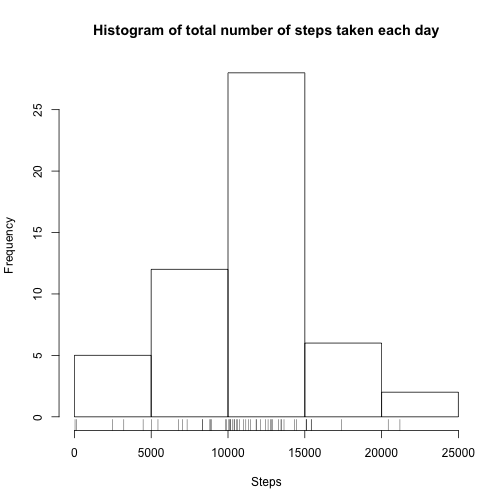
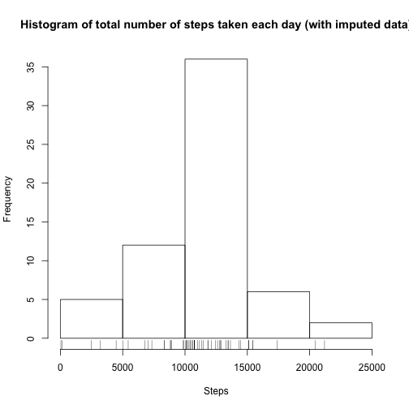

## Loading and preprocessing the data
We first read the activities assigning the right classes to each column:

* steps: numeric
* date: date
* interval: numeric

Even though we could use characters for the interval, numeric was chosen as it provides easier limiting for the graphs.

```r
activity <- read.csv(unz('activity.zip', 'activity.csv'), colClasses=c("numeric","Date","numeric"))
```

## What is mean total number of steps taken per day?
First we aggregate the number of steps per day.

```r
stepsPerDay <- aggregate(steps ~ date, data=activity, sum)
```

And plot an histogram with the aggregated number of steps.

```r
hist(stepsPerDay$steps, main='Histogram of total number of steps taken each day', xlab='Steps')
rug(stepsPerDay$steps)
```

 

Using the same aggregation to calculate the desired mean and median.

```r
mean(stepsPerDay$steps)
```

```
## [1] 10766.19
```

```r
median(stepsPerDay$steps)
```

```
## [1] 10765
```

## What is the average daily activity pattern?
Now we aggregate the number of steps per interval so we can see how it varies daily.

```r
dailyActivity <- aggregate(steps ~ interval, data=activity, mean)
```

And we plot the aggregated data.

```r
plot(steps ~ interval, data = dailyActivity, type='l')
```

 

To answer the question:

Which 5-minute interval, on average across all the days in the dataset, contains the maximum number of steps?

The dataset is filtered with the help of the function which.max

```r
dailyActivity$interval[which.max(dailyActivity$steps)]
```

```
## [1] 835
```

## Imputing missing values
The number of missing values is calculated simply with the function is.na

```r
missingValues <- is.na(activity$steps)
sum(missingValues)
```

```
## [1] 2304
```

And we create a new data.frame from the original one.

To fill-in the missing steps, first we match the interval of the missing data with the interval on our daily aggregated data.frame. By doing that we can simply assign the missing steps using the mean previous calculated.

```r
imputedActivity <- activity
matchingIntervals <- match(imputedActivity[missingValues, 'interval'], dailyActivity$interval)
imputedActivity[missingValues, 'steps'] <- dailyActivity$steps[matchingIntervals]
```

With the imputed data, we can now recreate the histogram and recalculate the mean and median.

```r
imputedStepsPerDay <- aggregate(steps ~ date, data=imputedActivity, sum)

hist(imputedStepsPerDay$steps, main='Histogram of total number of steps taken each day (with imputed data)', xlab='Steps')
rug(imputedStepsPerDay$steps)
```

 

```r
mean(imputedStepsPerDay$steps)
```

```
## [1] 10766.19
```

```r
median(imputedStepsPerDay$steps)
```

```
## [1] 10766.19
```
Seems that only the median changes by a bit.

## Are there differences in activity patterns between weekdays and weekends?
First we classify our data according to the weekday/weekend separation. With that we simply aggregate the data and plot.

```r
imputedActivity$weekend <- factor(weekdays(imputedActivity$date) %in% c("Saturday", "Sunday"))
levels(imputedActivity$weekend) <- c("weekday", "weekend")

stepsPerDayWeekday <- aggregate(steps ~ interval + weekend, imputedActivity, mean)

library(lattice)
xyplot(steps ~ interval | weekend, data=stepsPerDayWeekday, type = "l", xlab='Interval', ylab="Number of steps", layout=c(1, 2))
```

 
